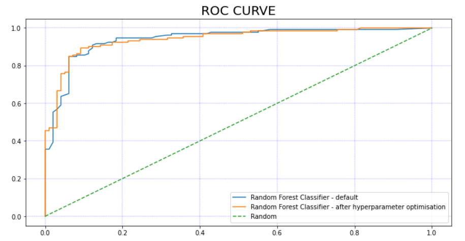
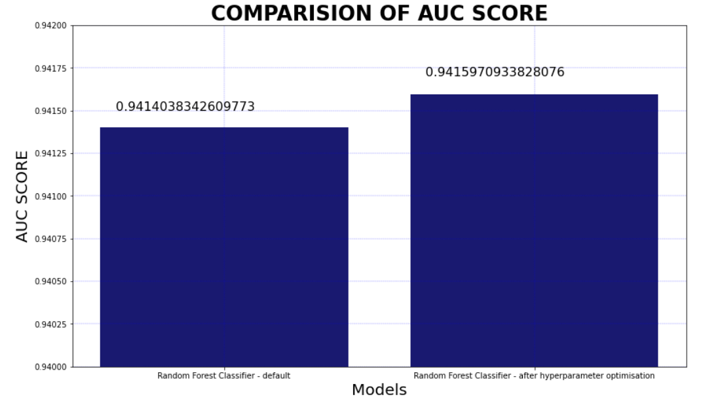

# Heart Failure Prediction

## Explanation of the project
This project is an attempt to accurately predict whether someone is at serious risk of heart failure given a number of inputs provided in the dataset (see below).

This project will adopt the following steps to achieve this:
1) Data exploration and analysis - Understanding the data is key to achieving good results from the ML model.  How large is the dataset? What data types are in the dataset?  Are there any null values or outliers? How correlated are the different features?
2) Cleanse the data as necessary - eg Deal with null values and outliers.
3) Model selection - as this will be treated as a classification problem, a suitable model will need to be chosen.  Also, the volume/complexity of data along with the interpretability of results will need to be taken into consideration.
4) Data preparation for model - depending on the model chosen there may need to be some scaling, normalisation and encoding applied to the data.
5) Splitting data into Training and validation set - after the model is trained, the validation set will be used in order to assess the performance of the model.
6) Fitting the Model using test data and assess results on validation set - Using existing python libraries the selected model will be fitted to the test data and then resulting model applied to the validation set.
7) Hyperparameter Tuning - Depending on the model a number of hyperparameters will be tuned to try and achieve better results.
8) Evaluation and next steps - The effect of the hyperparamter tuning needs to be assessed and possible next steps discussed.

## DATA

This dataset was created by combining different datasets already available independently but not combined before. In this dataset, 5 heart datasets are combined over 11 common features which makes it the largest heart disease dataset available so far for research purposes. The five datasets used for its curation are:

Cleveland: 303 observations
Hungarian: 294 observations
Switzerland: 123 observations
Long Beach VA: 200 observations
Stalog (Heart) Data Set: 270 observations
Total: 1190 observations Duplicated: 272 observations

**Final dataset: 918 observations**

Every dataset used can be found under the Index of heart disease datasets from UCI Machine Learning Repository on the following link: https://archive.ics.uci.edu/ml/machine-learning-databases/heart-disease/

**Citation**
fedesoriano. (September 2021). Heart Failure Prediction Dataset. Retrieved [Date Retrieved] from https://www.kaggle.com/fedesoriano/heart-failure-prediction.

**Acknowledgements**
Creators:

Hungarian Institute of Cardiology. Budapest: Andras Janosi, M.D.
University Hospital, Zurich, Switzerland: William Steinbrunn, M.D.
University Hospital, Basel, Switzerland: Matthias Pfisterer, M.D.
V.A. Medical Center, Long Beach and Cleveland Clinic Foundation: Robert Detrano, M.D., Ph.D.
Donor: David W. Aha (aha '@' ics.uci.edu) (714) 856-8779

## MODEL 
This is a binary classification problem (heart disease or no heart disease) with a mixture of numberical and classification features.

As such we have a number of models we could choose from, the main ones I chose from being:
Logistic Regression, Support Vector Machines, Naive Bayes classifier, Decision Tree classifier, Random Forest classifier and K-nearest neighbours

The purpose of this project is to see the effect of tuning hyperparameters within a ML Model.  Therefore, rather than assesing the performance of the different types of models I have chosen to use just the Random Forest classifier.  I chose this model as a) the advantages of the model (below) appeared to fit the data well and b) the model has number of hyperparameters are able to be tuned.

Through investigation the following advantages of Random Forest classifiers suited the dataset well:  
· It overcomes the problem of overfitting by averaging or combining the results of different decision trees.   The dataset has some features that are highly correlated to the outcome so we need to reduce the effect of overfitting.
· Random forests work well for a large range of data items than a single decision tree does.
· Random forest has less variance than a single decision tree.
· Random forests are very flexible and possess very high accuracy.
· Scaling of data is not required in a random forest algorithm. It maintains good accuracy even after providing data without scaling.  Therefore, I can train the model without applying scaling.  As well as assisting at the fitting stage it makes the resulting model more easily applied to new data by non-technical users.
· Random Forest algorithms maintain good accuracy even when a large proportion of the data is missing.

## HYPERPARAMETER OPTIMSATION
Using a Randomised Search Grid I tuned the following parameters:

n_estimators: The number of trees in the forest.
min_samples_split: The minimum number of samples required to split an internal node
max_leaf_nodes: Sets a condition on the splitting of the nodes in the tree and hence restricts the growth of the tree.
max_features: The number of features to consider when looking for the best split
max_depth: The max_depth of a tree in Random Forest is defined as the longest path between the root node and the leaf node.
bootstrap: Whether bootstrap samples are used when building trees. If False, the whole dataset is used to build each tree.

## RESULTS
A summary of the results 

## NEXT STEPS
- Use K-fold validation techniques to further improve results
- Evaluate other models and compare the results to these
- Apply model to unseen data
